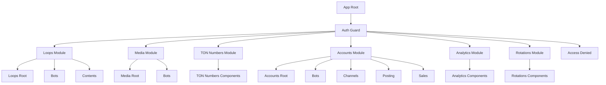

# Архитектура проекта Frontend

## Обзор

Проект представляет собой Angular-приложение, построенное на основе Nx монорепозитория. Это система управления ботами и контентом с модульной архитектурой, использующая современные подходы к разработке фронтенд-приложений.

## Технологический стек

### Основные технологии

- **Angular 20.0.7** - основной фреймворк
- **Nx 21.2.4** - инструмент для управления монорепозиторием
- **TypeScript 5.8.3** - язык программирования
- **RxJS 7.8.0** - реактивное программирование
- **Taiga UI 3.101.0** - UI библиотека компонентов

### Дополнительные библиотеки

- **Angular OAuth2 OIDC** - аутентификация
- **Centrifuge** - WebSocket соединения для real-time обновлений
- **Class Transformer** - трансформация объектов
- **Lodash ES** - утилиты для работы с данными
- **DOMPurify** - санитизация HTML

### Инструменты разработки

- **Jest** - тестирование
- **Cypress** - E2E тестирование
- **ESLint** - линтинг кода
- **Stylelint** - линтинг стилей
- **Prettier** - форматирование кода

## Структура проекта

### Приложения (apps/)

#### 1. breez-fake-app (основное приложение)

- **Путь**: `apps/breez-fake-app/`
- **Тип**: Angular приложение
- **Префикс**: `sp`
- **Описание**: Основное приложение для управления ботами, контентом и аналитикой

**Ключевые особенности:**

- Использует standalone компоненты (Angular 17+)
- Настроен с custom esbuild для быстрой сборки
- Интегрирован с Taiga UI для компонентов
- Поддерживает lazy loading модулей
- Настроен для работы с WebSocket (Centrifuge)

#### 2. breez-fake-app E2E (тестирование)

- **Путь**: `apps/breez-fake-app-e2e/`
- **Тип**: Cypress E2E тесты
- **Описание**: End-to-end тесты для основного приложения

### Библиотеки (libs/)

#### 1. @breez/auth

- **Путь**: `libs/auth/`
- **Назначение**: Аутентификация и авторизация
- **Компоненты**:
  - Guards (auth guard)
  - Interceptors (auth interceptor)
  - Services (auth service, auth API)
  - Constants (конфигурация аутентификации)

#### 2. @breez/core

- **Путь**: `libs/core/`
- **Назначение**: Общие утилиты и сервисы
- **Компоненты**:
  - **Classes**: Базовые классы (Table, ListDataSource, CustomControl)
  - **Components**: Переиспользуемые компоненты (RoutableDialog)
  - **Directives**: Директивы (HasPermission, InfiniteScroll, BindQueryParams)
  - **Guards**: Гарды (HasPermission, HasUnsavedChanges)
  - **Helpers**: Утилиты (BulkActionsHandler, PhoneNumberFormat)
  - **Interceptors**: HTTP интерцепторы
  - **Pipes**: Пайпы (DateFormatter, PhoneNumberFormatter)
  - **Services**: Сервисы (Centrifuge, Notifications, Permissions)
  - **Models**: Модели данных
  - **Enums**: Перечисления (Permission, BulkResponseStatus)

#### 3. @breez/error-handling

- **Путь**: `libs/error-handling/`
- **Назначение**: Обработка ошибок
- **Компоненты**:
  - Interceptors (error handling interceptor)
  - Services (error service)
  - UI компоненты для отображения ошибок
  - Models (error entity)

#### 4. @breez-fake-app/\*

- **Путь**: `libs/breez-fake-app/`
- **Назначение**: Бизнес-логика приложения breez-fake-app

##### API библиотеки (@breez-fake-app/api/\*)

- **accounts** - API для работы с аккаунтами
- **analytics** - API для аналитики
- **bots** - API для работы с ботами
- **channels** - API для каналов
- **contents** - API для контента
- **cycles** - API для циклов
- **files-upload** - API для загрузки файлов
- **geos** - API для географических данных
- **languages** - API для языков
- **media** - API для медиа
- **payments** - API для платежей
- **roles** - API для ролей
- **ton** - API для TON
- **users** - API для пользователей

##### Feature библиотеки (@breez-fake-app/features/\*)

- **accounts** - Управление аккаунтами
  - bots - управление ботами аккаунтов
  - channels - управление каналами
  - posting - публикация контента
  - sales - продажи
- **analytics** - Аналитика и метрики
- **loops** - Управление циклами
  - bots - боты в циклах
  - contents - контент в циклах
- **media** - Управление медиа
- **rotations** - Ротации
- **ton-numbers** - TON номера

##### Component библиотеки (@breez-fake-app/components/\*)

- **accounts** - Компоненты для аккаунтов
- **avatar-control** - Контрол аватара
- **bot-type-control** - Контрол типа бота
- **bots-upsert-dialog** - Диалог создания/редактирования ботов
- **file-upload** - Загрузка файлов
- **geo-control** - Контрол географии
- **language-control** - Контрол языка
- **marketers-control** - Контрол маркетологов

##### Service библиотеки (@breez-fake-app/services/\*)

- **base-form** - Базовые формы
- **base-upsert** - Базовые операции создания/обновления
- **bots-events** - События ботов
- **generate-bot-info** - Генерация информации о ботах

##### UI библиотека (@breez-fake-app/ui/\*)

- Переиспользуемые UI компоненты

#### 5. @breez-fake-app/tree

- **Путь**: `libs/tree/`
- **Назначение**: Компоненты для работы с древовидными структурами

## Архитектурные паттерны

### 1. Модульная архитектура

- Каждая функциональность выделена в отдельную библиотеку
- Четкое разделение ответственности между модулями
- Возможность независимой разработки и тестирования

### 2. Feature-based структура

- Организация по функциональным областям (accounts, analytics, loops, media)
- Каждая feature содержит свои компоненты, сервисы, модели
- Lazy loading для оптимизации производительности

### 3. API-First подход

- Отдельные API библиотеки для каждого домена
- Типизированные модели данных
- Централизованное управление HTTP запросами

### 4. Компонентная архитектура

- Переиспользуемые компоненты в отдельных библиотеках
- Standalone компоненты (Angular 17+)
- SCAM (Single Component Angular Module) подход

### 5. Реактивное программирование

- Широкое использование RxJS
- Реактивные потоки данных
- Централизованное управление состоянием

## Система маршрутизации

### Основные маршруты

```typescript
/loops - Управление циклами (требует: BotsRead, CyclesRead, BotsContentsRead)
/media - Управление медиа (требует: MediaFoldersRead)
/ton-numbers - TON номера (требует: NumbersRead)
/accounts - Управление аккаунтами (требует: AccountsRead)
/analytics - Аналитика (требует: AnalyticsMetricsRead)
/rotations - Ротации (требует: PaymentsSellersPhrasesRead)
```

### Система авторизации

- **authGuard** - проверка аутентификации
- **hasPermissionGuard** - проверка разрешений
- **AccessDeniedComponent** - компонент для отказа в доступе

## Система зависимостей

### Иерархия зависимостей

```
apps/breez-fake-app
├── @breez/auth
├── @breez/core
├── @breez/error-handling
└── @breez-fake-app/* (все библиотеки breez-fake-app)

@breez-fake-app/features/*
├── @breez/core
├── @breez-fake-app/api/*
├── @breez-fake-app/components/*
├── @breez-fake-app/services/*
└── @breez-fake-app/ui/*

@breez-fake-app/api/*
├── @breez/core
└── другие @breez-fake-app/api/* (взаимные зависимости)
```

### Path mapping

Все библиотеки настроены через path mapping в `tsconfig.base.json`:

- `@breez/*` - общие библиотеки
- `@breez-fake-app/*` - библиотеки breez-fake-app

## Система сборки и развертывания

### Nx конфигурация

- **Кэширование**: Включено для всех задач
- **Параллельное выполнение**: Настроено для тестов и линтинга
- **Зависимости**: Автоматическое определение зависимостей между проектами

### Сборка

- **Development**: Быстрая сборка с source maps
- **Production**: Оптимизированная сборка с минификацией
- **Custom esbuild**: Используется для ускорения сборки

### Тестирование

- **Unit тесты**: Jest для всех библиотек
- **E2E тесты**: Cypress для основного приложения
- **Coverage**: Настроен сбор покрытия кода

## Система стилей

### SCSS

- Используется SCSS для стилизации
- Taiga UI темы интегрированы
- Модульная система стилей

### Taiga UI

- Основная UI библиотека
- Кастомизированные темы
- Responsive дизайн

## Real-time функциональность

### Centrifuge WebSocket

- Интеграция с Centrifuge для real-time обновлений
- Подписка на каналы пользователей
- Автоматическое переподключение

## Безопасность

### Аутентификация

- OAuth2 OIDC
- JWT токены
- Автоматическое обновление токенов

### Авторизация

- Система разрешений (Permission enum)
- Гарды для проверки доступа
- Роли пользователей

### Санитизация

- DOMPurify для очистки HTML
- XSS защита

## Мониторинг и логирование

### Обработка ошибок

- Централизованная обработка ошибок
- Пользовательские уведомления об ошибках
- Логирование в консоль

### Аналитика

- Интеграция с аналитическими сервисами
- Метрики производительности

## Разработка и DevOps

### Git hooks

- Husky для pre-commit проверок
- Автоматический линтинг и тестирование

### CI/CD

- Nx Cloud для кэширования
- Автоматические проверки на изменения
- Параллельное выполнение задач

### Качество кода

- ESLint с правилами для Angular
- Stylelint для SCSS
- Prettier для форматирования
- Автоматические проверки при коммитах

## Рекомендации по развитию

### 1. Масштабирование

- Продолжать модульную архитектуру
- Выделять новые библиотеки при росте функциональности
- Использовать lazy loading для новых features

### 2. Производительность

- Оптимизировать bundle size
- Использовать OnPush change detection
- Реализовать виртуализацию для больших списков

### 3. Тестирование

- Увеличить покрытие unit тестами
- Добавить интеграционные тесты
- Автоматизировать E2E тестирование

### 4. Документация

- Документировать новые API
- Создавать Storybook для компонентов
- Ведение changelog

## Диаграмма архитектуры

```mermaid
graph TB
    subgraph "Applications"
        A[breez-fake-app App]
        B[breez-fake-app E2E]
    end

    subgraph "Core Libraries"
        C[@breez/auth]
        D[@breez/core]
        E[@breez/error-handling]
    end

    subgraph "breez-fake-app Libraries"
        F[@breez-fake-app/api/*]
        G[@breez-fake-app/features/*]
        H[@breez-fake-app/components/*]
        I[@breez-fake-app/services/*]
        J[@breez-fake-app/ui/*]
        K[@breez-fake-app/tree]
    end

    subgraph "External Dependencies"
        L[Angular 20]
        M[Taiga UI]
        N[RxJS]
        O[Centrifuge]
        P[OAuth2 OIDC]
    end

    A --> C
    A --> D
    A --> E
    A --> F
    A --> G
    A --> H
    A --> I
    A --> J

    G --> F
    G --> H
    G --> I
    G --> J
    G --> D

    H --> D
    H --> J

    I --> D
    I --> F

    F --> D

    C --> L
    D --> L
    D --> M
    D --> N
    D --> O
    E --> L

    A --> L
    A --> M
    A --> N
    A --> O
    A --> P
```

## Диаграмма маршрутизации



## Заключение

Проект демонстрирует современный подход к разработке Angular приложений с использованием Nx монорепозитория. Архитектура обеспечивает:

- **Масштабируемость**: Модульная структура позволяет легко добавлять новую функциональность
- **Переиспользование**: Общие компоненты и сервисы вынесены в отдельные библиотеки
- **Производительность**: Lazy loading и оптимизированная сборка
- **Качество**: Комплексная система тестирования и линтинга
- **Безопасность**: Многоуровневая система авторизации и санитизации

Архитектура готова к дальнейшему развитию и масштабированию.
